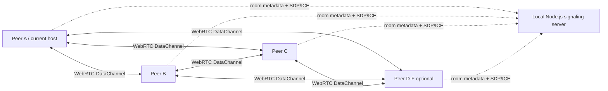
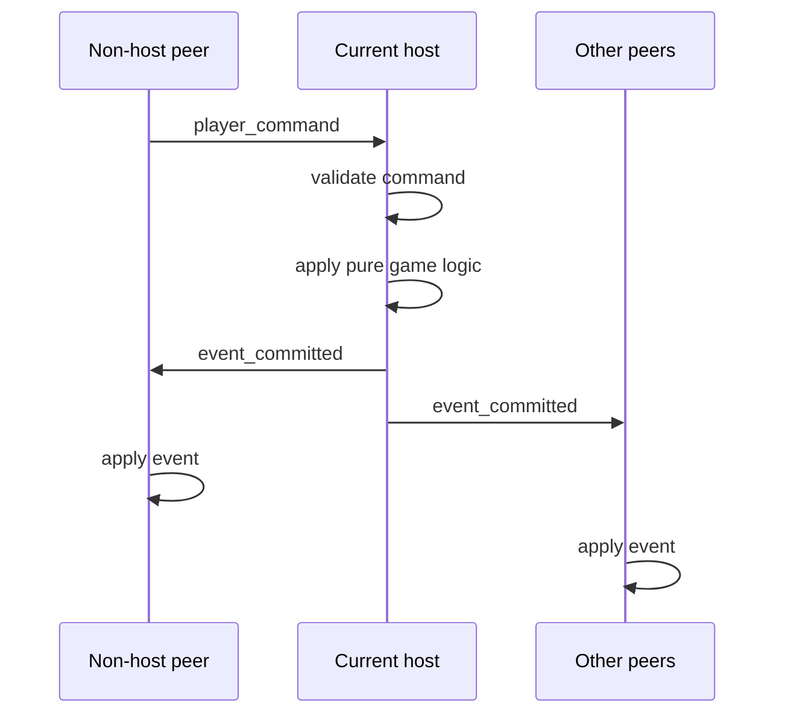
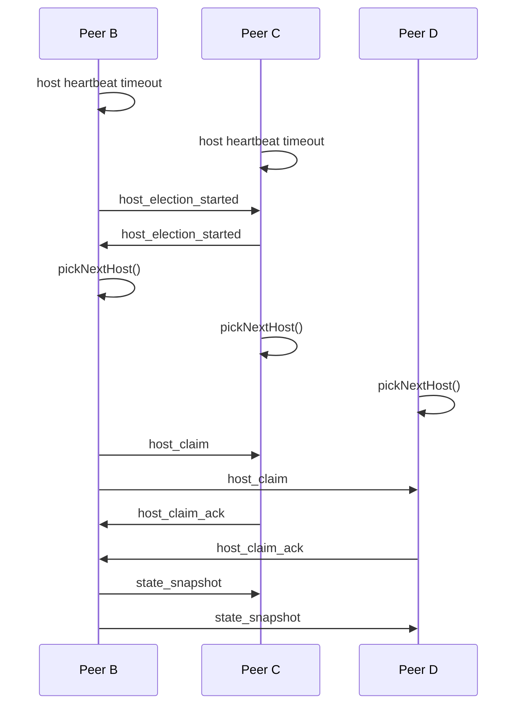

# Penguin Party ネットワーク仕様

この文書は、`Penguin Party` の P2P マルチプレイ通信を実装するための設計仕様です。
ゲームルールと状態設計は `docs/game-rules.ja.md` と `docs/game-spec.md` を参照します。

## 1. 重要な決定と要確認点

### この文書で採用する方式

- WebRTC DataChannel による P2P 通信を使う
- P2P 接続の ICE/STUN 設定には Google の無料 STUN サーバー `stun:stun.l.google.com:19302` を使う
- ローカルの Node.js サーバーは、ルーム作成、ルーム検索、パスワード確認、WebRTC signaling のみに使う
- Node.js サーバーはゲームルールの正状態を持たない
- ゲームのメインロジックは、現在のゲームホストだけが実行する
- 各 player peer のゲームセッションは、ホスト交代に備えて完全なゲーム状態、イベントログ、最新スナップショットを保持する
- spectator peer は表示用の公開状態に加え、復旧専用の AES-GCM 暗号化済み完全 snapshot をメモリだけに保持する。復号鍵は受け取らない
- signaling server が接続中のホスト切断を検知した場合、残っている online player から次のホストを1人選び、その `peerId` を全 peer へ canonical な選出結果として通知する
- すべての room は room list に表示し、パスワード付き room では参加時にパスワードを要求できる

### 仕様の優先順位

マルチプレイ通信は、`docs/game-spec.md` とこの文書の両方で「current host authoritative」に統一します。
ローカル Node.js server は room list / room management / signaling のみを担当し、ゲームルールの正状態は持ちません。

仕様の参照優先順位は次の通りです。

1. `docs/network-spec.md`
2. `docs/game-spec.md`
3. `docs/game-rules.ja.md`

ただし、ゲームルールそのものは常に `docs/game-rules.ja.md` を正とします。

### 要確認またはリスクがある点

1. player peer が完全なゲーム情報を持つ場合、他プレイヤーの手札や山札順もローカルに存在します。
   UI で隠しても、ブラウザ DevTools などで確認できるため、チート耐性はありません。
   spectator peer には完全なゲーム情報を平文で配らず、観戦用の公開 snapshot と、player 全滅時の復旧にだけ使う暗号文を配ります。
   友人同士の軽量オンライン対戦や開発検証には向きますが、公開サービスとして公平性を保証する用途には向きません。

2. Google STUN だけでは、すべてのネットワーク環境で接続できるとは限りません。
   STUN は NAT 越えを補助しますが、対称 NAT、企業ネットワーク、厳しいファイアウォールでは TURN サーバーが必要になる場合があります。
   この仕様では要件に合わせて TURN を必須にしませんが、接続失敗は仕様上あり得ます。

3. ホスト切断時に各 peer が独立して次のホストを選ぶと、接続状態の観測差によって結果がずれる可能性があります。
   通常経路では signaling server の選出結果を canonical とし、`peer_disconnected.hostPeerId` を全 peer がそのまま採用します。

4. ローカル Node.js サーバーは、インターネット越しのプレイヤーから直接アクセスできるとは限りません。
   開発時は `localhost` や同一 LAN で十分ですが、外部公開する場合は公開ホスト、HTTPS/WSS、またはトンネルが必要です。

## 2. 目的

このネットワーク仕様の目的は次の通りです。

- 2〜6人の player による WebRTC P2P マルチプレイを成立させる
- ゲームロジックをホスト 1 人に集約する
- ホスト以外の player peer も完全な状態を複製し、ホスト切断時にゲームを継続できるようにする
- spectator peer は公開状態と復号不能な復旧暗号文を保持するが、host migration には参加しない
- ローカル Node.js サーバーを中央集権的なゲームサーバーではなく、軽量な room list / signaling サーバーとして使う
- 鍵なし room と鍵付き room をサポートする
- Playwright MCP で Peer A/B/C および最大 Peer F までの検証を行いやすい通信設計にする

## 3. 非目的

この仕様では次のことを扱いません。

- 不正プレイヤーに対する強いチート防止
- サーバー authoritative な公開対戦基盤
- TURN サーバーによる接続保証
- 不特定多数向けの公開配信、大規模 spectator、配信者向け moderation
- グローバルランキング、アカウント連動ランキング、長期保存
- 複数ルームをまたぐ永続的なマッチメイキング

## 4. 全体構成

構成要素は次の3種類です。



### Local Node.js signaling server

ローカル開発と E2E test では、サーバー類は `1520x` の port range を使います。npm scripts は同一 LAN の端末から接続できるように、dev server と signaling server を `0.0.0.0` に bind します。

- Vite app: `127.0.0.1:15200` または `<LAN_IP>:15200`
- Local Node.js signaling server: `127.0.0.1:15201` または `<LAN_IP>:15201`

port は環境変数から読み込み、空文字または不正な値の場合は上記の default port を使います。

- `APP_HOST`: Vite dev server bind host。default は `0.0.0.0`
- `APP_PORT`: Vite dev server port
- `SIGNALING_HOST`: Local Node.js signaling server bind host。default は `0.0.0.0`
- `SIGNALING_PORT`: Local Node.js signaling server port
- `VITE_SIGNALING_HOST`: browser client が接続する signaling host。default は現在の page host
- `VITE_SIGNALING_PORT`: browser client が接続する signaling port
- `VITE_SIGNALING_URL`: browser client が接続する signaling URL。指定された場合は `VITE_SIGNALING_PORT` より優先する

browser client は Landing page の signaling server 入力欄から接続先を選択できます。

- page URL の `signaling-server` query がある場合、その値を signaling server 入力欄の初期値にする
- page URL の `signaling-server` query がある場合、Landing page の初回表示時にその URL へ一度だけ接続確認を試みる
- `signaling-server` query がない場合、`VITE_SIGNALING_URL`、`VITE_SIGNALING_HOST` / `VITE_SIGNALING_PORT`、現在の page host + default port の順で初期値を決める
- ユーザーが signaling server への接続確認に成功した場合、その URL を `signaling-server` query に書き戻す
- 接続確認は signaling server の `/rooms` に対して行い、成功した接続先だけを以降の room list / room create / room join / WebSocket signaling に使う

責務:

- ルーム作成
- room list の一覧配信
- 鍵付き room のパスワード確認
- 参加者の signaling 用接続管理
- WebRTC の offer、answer、ICE candidate の中継
- ルーム参加中の peer 一覧通知

責務ではないもの:

- ゲームルールの検証
- 山札生成
- 手札管理
- 着手の確定
- 勝敗判定
- ホスト移譲後の正状態判断

### Current host

現在のホストは、その時点の authoritative peer です。

責務:

- ルーム作成直後の初期ホストになる
- ゲーム開始可否を判断する
- 山札、配札、開始プレイヤーなどのルール状態を生成する
- プレイヤーコマンドを検証する
- 確定イベントを採番する
- role に応じた状態スナップショットを配信する
  - player peer には host migration 用の完全 snapshot を送る
  - spectator peer には観戦用の公開 snapshot と AES-GCM 暗号化済み完全 snapshot を送る
- heartbeat を送る
- 自身が離脱する場合は可能なら host handoff を開始する

### Non-host player peers

ホスト以外の player peer も、ホスト交代に備えて完全な複製状態を保持します。

責務:

- 自分の入力を `player_command` としてホストへ送る
- ホストからの `event_committed` を順番に適用する
- 最新スナップショットを保持する
- 状態ハッシュを検証する
- ホスト heartbeat を監視する
- ホスト切断時に host election に参加する

### Spectator peers

spectator peer は、ゲーム中の途中参加者として観戦用の公開状態と、復号鍵を持たない暗号化済み完全 snapshot を保持します。

責務:

- current host から spectator snapshot を受け取る
- current host から revision ごとの暗号化済み復旧 snapshot を受け取り、最新1件をメモリ保持する
- 場のピラミッド、各 player の表示名、残り手札数、脱落/上がり状態、得点、接続状態を表示する
- 手札、山札順、配札順、非公開乱数 seed を平文では保持せず、復旧鍵も保持しない
- `player_command` を送らない
- host election と quorum に参加しない

## 5. ネットワーク用語

```ts
type RoomId = string;
type PeerId = string;
type PlayerId = string;
type HostEpoch = number;
type EventSeq = number;
type Revision = number;

type PeerRole = 'host' | 'player' | 'spectator';
type PeerConnectionStatus =
  | 'new'
  | 'signaling'
  | 'connecting'
  | 'connected'
  | 'reconnecting'
  | 'disconnected'
  | 'closed';
```

### ID の方針

- `RoomId` は signaling server が生成する短い ID とする
- `PeerId` はブラウザセッションごとに生成する
- `PlayerId` はゲーム内プレイヤーとしての ID とする
- 再接続時は、保存済み `reconnectToken` により同じ `PlayerId` へ復帰する
- `PeerId` は接続の実体、`PlayerId` はゲーム上の席と扱う
- spectator はゲーム上の席を持たないため、`playerId: null` とする

## 6. ルーム仕様

### Room metadata

```ts
interface RoomMetadata {
  roomId: RoomId;
  roomName: string;
  createdAt: number;
  updatedAt: number;

  hostPeerId: PeerId | null;
  currentPlayerCount: number;
  currentSpectatorCount: number;
  maxPlayers: 6;

  status: 'waiting_for_start' | 'playing';
  hasPassword: boolean;
}
```

room status:

- `waiting_for_start`: room はゲーム開始待ちで、player として参加できる
- `playing`: room はゲーム進行中です。round result / game result 表示中も `playing` として扱い、途中参加者は spectator になる
- 最終 `game_result` の確認 gate が完了したら、host は room status を `waiting_for_start` に戻す
- `closed` は持たない。参加 peer が0人になった room は signaling server が自動削除し、room list から消える
- 全 player が切断し spectator だけが残った間は `hostPeerId: null` とし、room と参加枠は保持する

### 鍵なし room

- 鍵なし room は room list に表示する
- `hasPassword: false` を返す
- パスワードなしで参加できる

### 鍵付き room

- 鍵付き room も room list に表示する
- room list には `roomId`, `roomName`, `hasPassword`, `currentPlayerCount`, `currentSpectatorCount`, `maxPlayers`, `status` を含める
- 鍵付き room への join は、player と spectator のどちらでもパスワードを必須にする
- room が `waiting_for_start` の場合、パスワード検証後に player として join できる
- room が `playing` の場合、パスワード検証後に spectator として join できる
- パスワードが設定されている場合、signaling server が検証する
- signaling server は平文パスワードを保存しない
- 開発用の簡易実装でも、最低限 `crypto.scrypt` などで password hash を保存する

```ts
interface RoomPasswordAuth {
  roomId: RoomId;
  passwordHash: string;
  passwordSalt: string;
  createdAt: number;
}
```

注意:

- HTTP のまま外部公開すると、パスワードは通信経路上で保護されません
- 外部公開時は HTTPS/WSS を必須にする
- 鍵付き room のパスワードは「参加ゲート」であり、P2P 接続後の不正操作を防ぐものではありません

## 7. Signaling server 仕様

### Transport

開発用は Node.js の HTTP + WebSocket でよいです。

- HTTP: ルーム作成、ルーム一覧、ヘルスチェック
- WebSocket: ルーム参加後の peer presence、SDP、ICE candidate 中継

### HTTP endpoints

```txt
GET  /health
GET  /rooms
POST /rooms
POST /rooms/:roomId/join
POST /rooms/:roomId/rejoin-code
POST /rooms/:roomId/rejoin-codes/invalidate
POST /rejoin/status
POST /rejoin
```

### Create room request

```ts
interface CreateRoomRequest {
  roomName: string;
  password?: string;
  maxPlayers: 6;
  hostDisplayName: string;
}

interface CreateRoomResponse {
  room: RoomMetadata;
  peerId: PeerId;
  playerId: PlayerId;
  reconnectToken: string;
  signalingToken: string;
}
```

### Join room request

```ts
interface JoinRoomRequest {
  displayName: string;
  password?: string;
  reconnectToken?: string;
}

interface JoinRoomResponse {
  room: RoomMetadata;
  peerId: PeerId;
  playerId: PlayerId | null;
  role: PeerRole;
  reconnectToken: string;
  signalingToken: string;
  existingPeers: PeerSummary[];
}

interface PeerSummary {
  peerId: PeerId;
  playerId: PlayerId | null;
  displayName: string;
  joinedAt: number;
  role: PeerRole;
}
```

### Game re-join code request

最初のラウンドへ入るタイミングで、各 player client は signaling server に game-scoped re-join code を要求します。

```ts
interface RequestRejoinCodeRequest {
  peerId: PeerId;
  signalingToken: string;
}

interface RequestRejoinCodeResponse {
  rejoinCode: string;
}

type RejoinCodeStatusResponse =
  | { valid: false }
  | {
      valid: true;
      room: {
        roomId: RoomId;
        roomName: string;
        currentPlayerCount: number;
        maxPlayers: 6;
      };
    };
```

ルール:

- `RoomMetadata.status === 'playing'` の room でのみ発行する
- spectator には発行しない
- room が `playing` へ変わるたび、前 game の re-join code はすべて無効化し、新しい game 用 code を発行する
- code は `randomString.expiryTimestampBase36` 形式とし、発行から30分の絶対期限を code 自体に含める
- game が終了した時点で host は `/rooms/:roomId/rejoin-codes/invalidate` を呼び、全 code を無効化する
- room が `waiting_for_start` へ戻るときも、全 re-join code を無効化する
- client は発行されたcode、signaling server URL、game共通の256-bit復旧鍵をcodeごとのlocal storage entryへ保存し、現在Tabの`rejoin-code` queryにも同じcodeを設定する
- codeごとのstorage keyを使い、同一browser内の複数Tabが同時にcodeを追加しても互いを上書きしない
- 再訪時はlocal storageの全codeと現在Tabのquery codeを収集する。query codeがstorageにない場合はURLの`signaling-server`を使う
- code 内の期限を client で確認し、期限切れなら server へ問い合わせず code を削除する。現在Tabのqueryと一致する場合はqueryも同時に削除する
- 期限内の場合だけcodeごとのserverの`/rejoin/status`で有効性とroom情報を確認し、有効な場合だけroom名、参加枠数 / 上限、再参加ボタンを表示する
- queryだけに存在したcodeが有効ならlocal storageへ補完し、local storageを各Tab queryのsupersetに保つようbest effortで同期する
- reload、Tab close、通信断ではcodeを削除せず、game終了または明示Leave時だけ現在Tabのstorage entryとqueryを削除する
- 復旧鍵は re-join code と同じ entry にだけ保存し、code の期限切れ・削除・無効化と同時に破棄する
- server は re-join code の発行・状態確認・再参加・無効化操作の直前に、全 room の期限切れまたは不正形式 code を掃除する
- 再参加ボタンを押したときだけ `POST /rejoin` を実行する
- code に紐づく player がすでに接続中の場合、server は re-join を拒否する
- code が存在しない、期限切れ、別 game の code、または無効化済みの場合、server は `invalid_rejoin_code` として拒否する

### WebSocket signaling messages

```ts
type SignalingClientMessage =
  | { type: 'hello'; roomId: RoomId; peerId: PeerId; signalingToken: string }
  | { type: 'offer'; toPeerId: PeerId; description: RTCSessionDescriptionInit }
  | { type: 'answer'; toPeerId: PeerId; description: RTCSessionDescriptionInit }
  | { type: 'ice_candidate'; toPeerId: PeerId; candidate: RTCIceCandidateInit }
  | { type: 'leave_room' };

type SignalingServerMessage =
  | { type: 'hello_ok'; room: RoomMetadata; peers: PeerSummary[] }
  | { type: 'peer_joined'; peer: PeerSummary; hostPeerId: PeerId | null }
  | { type: 'peer_disconnected'; peerId: PeerId; hostPeerId: PeerId | null }
  | { type: 'peer_left'; peerId: PeerId }
  | { type: 'offer'; fromPeerId: PeerId; description: RTCSessionDescriptionInit }
  | { type: 'answer'; fromPeerId: PeerId; description: RTCSessionDescriptionInit }
  | { type: 'ice_candidate'; fromPeerId: PeerId; candidate: RTCIceCandidateInit }
  | { type: 'error'; code: string; message: string };
```

### Signaling server の保存期間

開発用の最小構成では、ルーム情報はメモリ上に保存します。
プロセス再起動でルームは消えてよいです。

保存するもの:

- room metadata
- password hash
- joined peer summaries
- reconnect token hash
- WebSocket connection mapping

保存しないもの:

- 山札
- 手札
- 確定済みイベントログ
- 完全なゲーム状態

## 8. WebRTC 接続仕様

### ICE server configuration

```ts
export const RTC_CONFIG: RTCConfiguration = {
  iceServers: [
    {
      urls: 'stun:stun.l.google.com:19302',
    },
  ],
  iceCandidatePoolSize: 4,
};
```

方針:

- デフォルトでは Google の無料 STUN サーバーのみを使う
- TURN は必須にしない
- 接続失敗時は UI に「P2P connection failed」と表示する
- 将来、接続成功率を上げる場合は TURN サーバーを追加する

### Topology

2〜6人の player peer では full mesh を標準とします。
spectator peer は player 上限には含めません。
spectator peer は current host との DataChannel 接続を必須とし、他 player との full mesh 接続は必須にしません。
これにより、7人目以上の spectator を許容しつつ、host election の対象とする player mesh は最大6人に保ちます。

必要な PeerConnection 数:

| Players | Pair connections |
| --- | ---: |
| 2 | 1 |
| 3 | 3 |
| 4 | 6 |
| 5 | 10 |
| 6 | 15 |

理由:

- player は最大6人なので full mesh の接続数は許容範囲
- ホスト切断時も、残った peer 同士が直接通信できる
- Peer C 以降の late join や同期監査を検証しやすい
- spectator は host migration に参加しないため、完全な player mesh に入れない

### Offerer の決定

同時 offer による glare を避けるため、接続ペアごとに offerer を決定的に決めます。

```ts
function shouldCreateOffer(localPeer: PeerSummary, remotePeer: PeerSummary): boolean {
  if (localPeer.joinedAt !== remotePeer.joinedAt) {
    return localPeer.joinedAt < remotePeer.joinedAt;
  }
  return localPeer.peerId < remotePeer.peerId;
}
```

先に参加している peer が、後から参加した peer へ offer を作ることを基本とします。

### DataChannel

ゲーム用途では、信頼性と順序が重要なので、最初は reliable ordered channel のみで始めます。

```ts
interface GameDataChannelConfig {
  label: 'game';
  ordered: true;
  negotiated: false;
}
```

必要になった場合だけ、後から低優先の telemetry channel を追加します。
ターン制カードゲームなので、unreliable channel は当面不要です。

### DataChannel message size

ゲーム状態は小さいため、JSON message で扱います。
ただし大きなスナップショットを頻繁に送らないように、1 message は原則 64KB 未満を目標にします。

## 9. P2P メッセージ共通形式

すべての P2P メッセージは envelope で包みます。

```ts
interface P2PEnvelope<TPayload> {
  protocolVersion: 1;
  roomId: RoomId;
  fromPeerId: PeerId;
  toPeerId?: PeerId;
  hostPeerId: PeerId | null;
  hostEpoch: HostEpoch;
  messageId: string;
  sentAt: number;
  payload: TPayload;
}
```

共通ルール:

- `messageId` は重複排除に使う
- `hostEpoch` が古いメッセージは破棄する
- `roomId` が一致しないメッセージは破棄する
- `fromPeerId` が現在の接続相手と一致しないメッセージは破棄する
- JSON parse できないメッセージは切断候補として扱う

## 10. ゲームメッセージ

```ts
type P2PGamePayload =
  | HostHello
  | PeerReady
  | ReadyGateState
  | PlayerCommand
  | CommandRejected
  | EventCommitted
  | RoomPhaseChanged
  | StateSnapshot
  | StateHashReport
  | Heartbeat
  | SpectatorRecoverySnapshot
  | RecoverySnapshotRequest
  | RecoverySnapshotResponse
  | ResyncRequest
  | HostElectionStarted
  | HostClaim
  | HostClaimAck
  | HostHandoff;
```

### HostHello

新規接続後、現在ホストが peer に送る初期同期メッセージです。

```ts
interface HostHello {
  type: 'host_hello';
  currentHostPeerId: PeerId;
  hostEpoch: HostEpoch;
  eventSeq: EventSeq;
  playerIdByPeerId: Record<PeerId, PlayerId | null>;
  roleByPeerId: Record<PeerId, PeerRole>;
  snapshot: RoleScopedSnapshot;
  recoveryKey?: string;
  eventLogTail?: GameEvent[];
}
```

`eventLogTail` は player peer 向けの完全同期にだけ使います。
spectator peer には、手札や山札順を推測できる event log を送らず、必要な表示状態を `SpectatorGameSnapshot` にまとめて送ります。
`recoveryKey` は player peer にだけ送り、spectator 向け `host_hello` には含めません。

```ts
interface EncryptedRecoverySnapshot {
  version: 1;
  algorithm: 'AES-GCM';
  gameId: GameId;
  revision: Revision;
  eventSeq: EventSeq;
  stateHash: string;
  iv: string;
  ciphertext: string;
}

interface SpectatorRecoverySnapshot {
  type: 'spectator_recovery_snapshot';
  snapshot: EncryptedRecoverySnapshot;
}

interface RecoverySnapshotRequest {
  type: 'recovery_snapshot_request';
  requestId: string;
  requesterPlayerId: PlayerId;
  acceptedSource: 'player' | 'spectator';
}

type RecoverySnapshotResponse =
  | { type: 'recovery_snapshot_response'; requestId: string; sourceRole: 'player'; eventSeq: EventSeq; snapshot: ReplicatedGameSnapshot; recoveryKey: string }
  | { type: 'recovery_snapshot_response'; requestId: string; sourceRole: 'spectator'; snapshot: EncryptedRecoverySnapshot };
```

### PeerReady

peer が snapshot 適用後に送る ready 状態です。

```ts
interface PeerReady {
  type: 'peer_ready';
  playerId: PlayerId | null;
  role: PeerRole;
  ready: boolean;
  stateRevision: Revision;
  stateHash: string;
}
```

### ReadyGateState

host が開始待ちまたは結果確認画面の ready 状態を同期します。
これは snapshot 適用後の `PeerReady` とは別物です。

```ts
type ReadyGateKind = 'waiting_room' | 'round_result' | 'game_result';

interface ReadyGateState {
  type: 'ready_gate_state';
  gate: ReadyGateKind;
  readyPlayerIds: PlayerId[];
  requiredPlayerIds: PlayerId[];
}
```

ルール:

- ready gate の対象は online player だけで、spectator と disconnected / closed peer は含めない
- `waiting_room` gate は「準備完了 / 準備中に戻る」を同期する
- `round_result` gate は「次のラウンドへ / もう少し結果確認する」を同期する
- `game_result` gate は「開始待ちへ戻る / もう少し結果確認する」を同期する
- host は全 `requiredPlayerIds` が ready になった時点で次状態を確定する

### PlayerCommand

プレイヤー入力は、非ホストからホストへ送ります。
ホストだけが検証し、確定イベントに変換します。

```ts
type PlayerCommand =
  | {
      type: 'player_command';
      commandId: string;
      playerId: PlayerId;
      command:
        | { type: 'set_ready'; gate: ReadyGateKind; ready: boolean }
        | { type: 'play_card'; cardId: string; target: MoveTarget }
        | { type: 'request_rematch' }
        | { type: 'leave_game' };
      clientRevision: Revision;
      clientSentAt: number;
    };
```

ルール:

- host 以外は `player_command` を確定してはいけない
- host は `playerId` と送信元 `PeerId` の対応を検証する
- `playerId: null` の spectator は `player_command` を送ってはいけない
- host は現在の `activePlayerId` と合法手を検証する
- 同じ `commandId` を複数回受信した場合は冪等に処理する

### CommandRejected

```ts
interface CommandRejected {
  type: 'command_rejected';
  commandId: string;
  reason:
    | 'not_current_host'
    | 'not_your_turn'
    | 'illegal_move'
    | 'stale_revision'
    | 'game_not_ready'
    | 'unknown_player';
  expectedRevision: Revision;
}
```

### EventCommitted

ホストが検証済みの結果を全 peer に broadcast します。

```ts
interface EventCommitted {
  type: 'event_committed';
  event: RoleScopedEvent;
  eventSeq: EventSeq;
  revision: Revision;
  stateHash: string;
  snapshot?: RoleScopedSnapshot;
}

type RoleScopedEvent = GameEvent | SpectatorGameEvent;

interface SpectatorGameEvent {
  kind: 'spectator_event';
  publicState: PublicGameView;
  revision: Revision;
}
```

方針:

- 小規模ゲームなので、実装初期は各 `event_committed` に snapshot を付けてよい
- 最適化する場合は、通常は event のみ、5 event ごとまたはラウンド境界で snapshot を付ける
- peer は `eventSeq` が連続していない場合、即座に `resync_request` を送る
- spectator peer に送る `event_committed` は `SpectatorGameEvent` または `SpectatorGameSnapshot` に redaction し、hidden information を含む `GameEvent` をそのまま送らない

### RoomPhaseChanged

最終結果確認 gate の完了後、host は room を開始待ちに戻したことを peer に通知します。

```ts
interface RoomPhaseChanged {
  type: 'room_phase_changed';
  roomStatus: 'waiting_for_start';
  hostPeerId: PeerId;
}
```

peer はこの message を受けたら、保持している active game snapshot を破棄し、`waiting_room` UI に戻ります。

### StateSnapshot

late join、再同期、host migration 後に使います。

```ts
interface StateSnapshot {
  type: 'state_snapshot';
  snapshot: RoleScopedSnapshot;
  eventLogTail?: GameEvent[];
  revision: Revision;
  stateHash: string;
}
```

### Heartbeat

```ts
interface Heartbeat {
  type: 'heartbeat';
  hostPeerId: PeerId;
  hostEpoch: HostEpoch;
  revision: Revision;
  eventSeq: EventSeq;
  stateHash: string;
  serverTimeEstimate?: number;
}
```

推奨値:

- host heartbeat interval: 1000ms
- host timeout: 5000ms
- reconnect grace period: 15000ms

## 11. 複製状態

各 peer は次の状態を保持します。
player peer と spectator peer では、保持できる snapshot の種類が異なります。

```ts
interface ReplicatedGameSession {
  roomId: RoomId;
  localPeerId: PeerId;
  localPlayerId: PlayerId | null;
  localRole: PeerRole;

  currentHostPeerId: PeerId | null;
  hostEpoch: HostEpoch;

  snapshot: RoleScopedSnapshot;
  eventLog: GameEvent[];

  lastEventSeq: EventSeq;
  revision: Revision;
  stateHash: string;

  peers: Record<PeerId, PeerRuntimeState>;
}

type RoleScopedSnapshot = ReplicatedGameSnapshot | SpectatorGameSnapshot;

interface ReplicatedGameSnapshot {
  kind: 'player_replica';
  publicState: PublicGameView;
  privateStateByPlayerId: Record<PlayerId, PrivatePlayerReplica>;
  hostOnlyStateReplica: HostOnlyStateReplica;
  revision: Revision;
}

interface SpectatorGameSnapshot {
  kind: 'spectator_view';
  publicState: PublicGameView;
  revision: Revision;
  encryptedRecoverySnapshot: EncryptedRecoverySnapshot | null;
}

interface PrivatePlayerReplica {
  playerId: PlayerId;
  handCardIds: string[];
  reconnectTokenHash?: string;
}

interface HostOnlyStateReplica {
  randomSeed: string;
  deckOrder: string[];
  dealtCardIdsByPlayer: Record<PlayerId, string[]>;
  lastCommandIdsByPlayer: Record<PlayerId, string | null>;
}

interface PeerRuntimeState {
  peerId: PeerId;
  playerId: PlayerId | null;
  role: PeerRole;
  connectionStatus: PeerConnectionStatus;
  lastHeartbeatAt: number | null;
  lastKnownRevision: Revision;
  lastKnownStateHash: string | null;
}
```

spectator peer の `eventLog` は空配列、または公開表示の再生に必要な redacted event だけにします。
hidden information を含む `GameEvent` tail は player peer にだけ配信します。

### 完全複製の扱い

この仕様では、ホスト交代を成立させるため、非ホスト player peer も `privateStateByPlayerId` と `hostOnlyStateReplica` を保持します。
これは開発と友人同士のプレイを優先した設計です。

spectator peer は host migration に参加せず、表示用 `SpectatorGameSnapshot` と暗号化済み完全 snapshot の最新1件だけを保持します。
表示用 snapshot には `privateStateByPlayerId`, `hostOnlyStateReplica`, 山札順、配札順、非公開乱数 seed、各 player の手札 cardId を含めません。暗号化済み snapshot は UI state や debug export に展開せず、メモリ上の opaque blob として扱います。

UI 実装では、player peer でもローカルプレイヤー以外の手札を表示してはいけません。
ただし、player peer では DevTools などで内部状態を見られることは防げません。
spectator peer は復旧暗号文を受け取りますが鍵を受け取らないため、通常の spectator UI と debug state から hidden information を見られない設計にします。

### State hash

各 peer は snapshot 適用後に state hash を計算します。
player peer は完全 snapshot の hash を計算し、host election と desync 検出に使います。
spectator peer は spectator snapshot の hash だけを計算し、観戦表示の desync 検出にだけ使います。
spectator peer の hash は host election と quorum には使いません。

```ts
interface StateHashInput {
  protocolVersion: 1;
  hostEpoch: HostEpoch;
  revision: Revision;
  lastEventSeq: EventSeq;
  canonicalSnapshotJson: string;
}
```

ルール:

- JSON は key order を固定して canonicalize する
- hash は SHA-256 を使う
- host heartbeat に `stateHash` を含める
- 非ホスト player peer は不一致を検出したら `resync_request` を送る
- spectator peer は spectator snapshot の不一致を検出したら再取得を要求するが、host election には進まない

## 12. ゲームコマンド処理

### 通常フロー



### ホスト自身の入力

ホスト自身の入力も、内部的には `PlayerCommand` として同じ validation path に通します。
これにより、ホストだけ別処理になることを避けます。

### peer 側の検証

player peer は、ホストから受け取った `event_committed` をそのまま信じるだけでなく、可能な範囲でローカルの純粋関数で再検証します。

検証するもの:

- `eventSeq` が連続している
- `hostEpoch` が一致している
- active player の着手として正しい
- cardId がそのプレイヤーの手札に存在する
- target が合法手である
- 適用後の `stateHash` が host の報告と一致する

spectator peer は hidden information を持たないため、完全な合法手再検証はしません。
spectator peer は `eventSeq`, `hostEpoch`, spectator snapshot hash、公開表示の整合性だけを確認します。

不一致の場合:

1. `resync_request` を host に送る
2. 再同期後も不一致ならゲームを pause する
3. 必要なら host election を開始する

## 13. Host migration

### 切断検知

peer は current host の heartbeat を監視します。

host timeout 条件:

- 最後の valid heartbeat から 5000ms 以上経過
- DataChannel が `closed` または `failed`
- signaling server から host の `peer_disconnected` を受け取った

signaling server が利用可能な通常経路では、server がその時点で online の non-spectator player から次の host を選び、`peer_disconnected.hostPeerId` として通知します。
client はローカルで別の候補を再選出せず、この値を canonical な host として採用します。
切断した旧 host の player seat、hand、`activePlayerId` は削除・付け替えず、re-join と新 host による手番代行のために保持します。

online player が0人になった場合、server は `hostPeerId: null` を通知し、spectator を host に昇格させません。盤面はその revision で停止します。最初に `/rejoin` が成功した player を server が新 host として予約し、その player は online player へ復旧を要求した後、応答がなければ spectator の暗号文を local storage の復旧鍵で復号します。復旧後だけ heartbeat、着手、切断 player の代行を再開します。

### Election の基本方針

以下の peer-side election は、signaling server から canonical な切断通知を受け取れない場合の fallback 方針です。
要件では「ランダムで次のゲームホストが決まる」とします。
ただし、完全な P2P で各 peer が同じ結果に到達する必要があるため、決定的な random-like election を使います。

```ts
function pickNextHost(input: HostElectionInput): PeerId {
  const candidates = input.candidates
    .filter((candidate) => candidate.peerId !== input.previousHostPeerId)
    .filter((candidate) => candidate.role !== 'spectator')
    .filter((candidate) => candidate.playerId !== null)
    .filter((candidate) => candidate.connectionStatus === 'connected')
    .sort((a, b) => a.playerId!.localeCompare(b.playerId!));

  const seed = [
    input.roomId,
    input.hostEpoch,
    input.previousHostPeerId,
    input.lastEventSeq,
    input.revision,
    input.stateHash,
    input.gameRandomSeed,
  ].join(':');

  const index = sha256ToInteger(seed) % candidates.length;
  return candidates[index].peerId;
}

interface HostElectionInput {
  roomId: RoomId;
  hostEpoch: HostEpoch;
  previousHostPeerId: PeerId;
  lastEventSeq: EventSeq;
  revision: Revision;
  stateHash: string;
  gameRandomSeed: string;
  candidates: PeerRuntimeState[];
}
```

これにより、見た目はランダムでも、同じ状態を持つ peer は同じ host を選びます。

### Election messages

```ts
interface HostElectionStarted {
  type: 'host_election_started';
  previousHostPeerId: PeerId;
  reason: 'host_timeout' | 'host_left' | 'host_handoff_failed';
  electionInputHash: string;
  proposedHostPeerId: PeerId;
  observedRevision: Revision;
  observedStateHash: string;
}

interface HostClaim {
  type: 'host_claim';
  newHostPeerId: PeerId;
  previousHostPeerId: PeerId;
  newHostEpoch: HostEpoch;
  baseRevision: Revision;
  baseStateHash: string;
  eventLogTailHash: string;
}

interface HostClaimAck {
  type: 'host_claim_ack';
  newHostPeerId: PeerId;
  accepted: boolean;
  reason?: 'state_hash_mismatch' | 'stale_epoch' | 'different_candidate' | 'not_connected';
  localRevision: Revision;
  localStateHash: string;
}
```

### Migration flow



### Quorum

最大6人なので、以下のシンプルな quorum を使います。

- connected player peers の過半数が同じ `newHostPeerId` を受け入れたら host migration 成功
- spectator peer は quorum の分母にも投票にも含めない
- 2人プレイで host が落ちた場合、残り1人が単独で host になれる
- quorum が割れた場合、ゲームを pause し、UI に再同期またはルーム作り直しを促す

### Host handoff

ホストが正常に退出する場合は、切断前に handoff を行います。

```ts
interface HostHandoff {
  type: 'host_handoff';
  fromHostPeerId: PeerId;
  proposedNextHostPeerId: PeerId;
  nextHostEpoch: HostEpoch;
  snapshot: ReplicatedGameSnapshot;
  eventLogTail: GameEvent[];
}
```

正常 handoff の場合も、次ホストの選び方は `pickNextHost()` に揃えます。
ホストが任意の相手を指定すると、peer ごとに期待値がずれやすくなります。

### 旧ホストの復帰

旧ホストが再接続した場合:

- 現在の `hostEpoch` が旧ホストの知っている値より大きければ、旧ホストは non-host として復帰する
- 旧ホストは自分の古い host 権限で `event_committed` を送ってはいけない
- peer は古い `hostEpoch` の host message を破棄する

## 14. Late join と再接続

### Late join

room が `waiting_for_start` の間に Peer C 以降が参加した場合、その peer は player として参加します。

1. signaling server が既存 peer 一覧を返す
2. 新 peer と既存 peer が full mesh 接続を作る
3. current host が `host_hello` と snapshot を新 peer に送る
4. 新 peer が snapshot を適用する
5. 新 peer が `peer_ready` を返す
6. host が `player_joined` event を commit する

room が `playing` の間に新 peer が参加した場合、その peer は spectator として参加します。

1. signaling server が `role: 'spectator'` と既存 peer 一覧を返す
2. spectator は current host と DataChannel 接続を作る
3. 必要に応じて spectator と他 peer の presence 用接続を作ってもよいが、full mesh は必須にしない
4. current host が `host_hello`、`SpectatorGameSnapshot`、`EncryptedRecoverySnapshot` を spectator に送る
5. spectator は snapshot を表示用に適用する
6. spectator は `peer_ready` を返す
7. host は `spectator_joined` event または presence update を commit する

spectator の制約:

- `PlayerId` は割り当てず、`playerId: null` とする
- 席順、手札、得点、手番には参加しない
- `privateStateByPlayerId`, `hostOnlyStateReplica`, event log tail は平文で受け取らず、復旧鍵も受け取らない
- `play_card`, `set_ready` などの player command は送れない
- host election の候補にしない
- quorum の分母にも投票にも含めない
- 次のゲームを同じ room で開始する場合、host が許可すれば player として参加できる

### Reconnect

再接続では re-join code で元の player identity を復元し、ゲーム状態は次の優先順位で復旧します。

1. 接続できた online player peer の完全 snapshot と共通復旧鍵
2. online player がいない場合、spectator peer の暗号化済み完全 snapshotを local storage の鍵で復号
3. spectator もいない、暗号文がない、または鍵を失っている場合は復旧不可

signaling server は有効な code に紐づく同じ `PlayerId`、`PeerId`、display name、seat を返します。online player が残っていれば current host または別 player が完全 snapshot を返します。全 player 不在なら最初の復帰 player を host にし、spectator との DataChannel を作って暗号文を取得します。

## 15. 鍵付き room の参加フロー

```mermaid
sequenceDiagram
  participant A as Host browser
  participant S as Node signaling server
  participant B as Joining browser

  A->>S: POST /rooms password
  S->>S: hash password
  S-->>A: roomId + signalingToken
  B->>S: POST /rooms/:roomId/join password
  S->>S: verify password
  S-->>B: peerId + signalingToken + existingPeers
  B->>S: WebSocket hello
  S-->>A: peer_joined
  A-->>B: WebRTC offer via signaling
  B-->>A: WebRTC answer via signaling
  A<-->>B: WebRTC DataChannel
```

パスワード検証に失敗した場合:

```ts
interface JoinRoomError {
  code: 'room_full' | 'password_required' | 'invalid_password' | 'room_closed';
  message: string;
}
```

`room_full` は、`status === 'waiting_for_start'` で player として参加しようとしたときに `currentPlayerCount >= maxPlayers` の場合だけ返します。
`room_closed` は、参加者が0人になって room が自動削除された後や、パスワード入力中に対象 room が閉じられた後に join しようとした場合に返します。
`status === 'playing'` の room では、7人目以上でも player ではなく spectator として参加を許可します。
鍵付き room の場合も、spectator join にはパスワード検証を必須にします。

## 16. エラー処理

### Connection failure

WebRTC connection が失敗した場合:

- 対象 peer の `connectionStatus` を `disconnected` にする
- current host ではない peer の切断なら、presence event を commit する
- current host の切断なら host election を開始する

signaling の `peer_unavailable` は offer / answer / ICE の宛先 peer にだけ関係する一時的なエラーです。
global connection indicator へは表示せず、signaling server から切断通知を受けた peer への定期 offer retry は停止します。
同じ peer が re-join して `peer_joined` を受け取った時点で古い connection record を reset し、通常の接続確立を再開します。

### Signaling server disconnect

すでに WebRTC full mesh が成立している場合:

- 既存ゲームは継続できる
- late join と reconnect はできない
- peer 間の host migration は継続できる

### State divergence

state hash が一致しない場合:

1. `resync_request` を送る
2. host が `state_snapshot` を返す
3. それでも一致しない場合は pause
4. UI に「State sync error」を表示する

### Split brain

ネットワーク分断で複数 host が生まれた場合:

- より大きい `hostEpoch` を優先する
- 同じ `hostEpoch` で host が異なる場合は quorum を持つ側を優先する
- quorum を判定できない場合は pause する
- 自動で両方のゲームを merge しない

## 17. セキュリティと公平性

### WebRTC transport security

WebRTC DataChannel は DTLS により暗号化されます。
ただし、暗号化されるのは通信経路であり、各 peer のローカル状態はその peer のブラウザ内に存在します。

### Trust model

この仕様の trust model は「参加者を基本的に信頼する」です。

守れるもの:

- 通信経路上の盗聴リスク低減
- signaling server をゲーム authoritative にしない軽量構成
- ホスト切断後の継続
- accidental desync の検出

守れないもの:

- player peer が DevTools で複製済みの他人の手札を見る行為
- 改造クライアントによる不正 command 送信
- 悪意ある host による不正 event commit
- 鍵付き room password を知っている人の再配布

公開サービスにする場合は、次のどれかが必要です。

- サーバー authoritative 方式へ変更する
- hidden information を非ホスト player peer に配らない
- cryptographic commit-reveal で山札と手札を扱う
- アカウント、署名、BAN、監査ログを導入する

## 18. 実装モジュール案

```txt
src/network/
  types.ts
  rtcConfig.ts
  signalingClient.ts
  peerMesh.ts
  dataChannelProtocol.ts
  hostAuthority.ts
  hostElection.ts
  stateReplication.ts
  stateHash.ts
  roomClient.ts

server/
  signalingServer.ts
  roomStore.ts
  password.ts
```

### `peerMesh.ts`

責務:

- peer ごとの `RTCPeerConnection` を作る
- offer/answer/ICE を signaling client と接続する
- DataChannel open/close/error を管理する
- full mesh の接続状態を集約する

### `hostAuthority.ts`

責務:

- `PlayerCommand` を検証する
- 純粋ゲームロジックを実行する
- `GameEvent` と snapshot を生成する
- event seq と revision を採番する
- heartbeat を送る

### `stateReplication.ts`

責務:

- `event_committed` を順序どおり適用する
- snapshot を適用する
- event log を保持する
- missing event を検出する
- state hash を比較する

### `hostElection.ts`

責務:

- host timeout を検出する
- `pickNextHost()` を実行する
- host claim/ack を処理する
- quorum を判定する
- migration 中は入力を pause する

## 19. Playwright MCP 検証項目

P2P の動作確認では、少なくとも Peer A、Peer B、Peer C を別々の browser context で起動します。
2タブではなく、storage と session が分離された context を使います。

### Two-peer minimum flow

1. Peer A が鍵なし room を作る
2. Peer B が room list から参加する
3. Peer A/B の WebRTC DataChannel が open になる
4. Peer A がゲーム開始する
5. Peer A が1手実行する
6. Peer B に盤面更新が反映される
7. Peer B が1手実行する
8. Peer A に盤面更新が反映される
9. 両 peer の `revision` と `stateHash` が一致する

### 鍵付き room flow

1. Peer A が鍵付き room を作り、パスワードを設定する
2. Peer B の room list に鍵アイコン付きで同じ room が表示される
3. Peer B が誤ったパスワードで join し、失敗する
4. Peer B が正しいパスワードで join し、成功する
5. WebRTC 接続後、signaling server がゲーム状態を持っていないことを確認する

### Peer C late join flow

1. Peer A/B が接続済みで、room が `waiting_for_start` の状態を作る
2. Peer C が同じ room に player として参加する
3. Peer C が Peer A/B とそれぞれ DataChannel open になる
4. current host が Peer C に snapshot を送る
5. Peer C の画面が現在の盤面に追いつく
6. Peer C が1手実行する
7. Peer A/B に Peer C の更新が反映される
8. Peer A/B/C の `revision` と `stateHash` が一致する

### Spectator join flow

1. Peer A/B が接続済みで、room が `playing` の状態を作る
2. Spectator S が同じ room に参加する
3. Spectator S が current host と DataChannel open になる
4. current host が Spectator S に `SpectatorGameSnapshot` を送る
5. Spectator S の画面が現在の盤面に追いつく
6. Spectator S には手札、手番、`play_card` 操作が表示されない
7. Spectator S の local state に `privateStateByPlayerId`, `hostOnlyStateReplica`, 山札順、各 player の手札 cardId が存在しない
8. Peer A/B の次の1手が Spectator S の画面にも反映される

### Host disconnect flow

1. Peer A を host にする
2. Peer B/C を参加させる
3. ゲームを開始し、Peer A が active player の間に browser context を閉じる
4. signaling server が Peer A の切断を検知し、Peer B を canonical host として `peer_disconnected` で通知する
5. Peer B/C が同じ `hostPeerId` を採用し、Peer A の seat と active turn を維持する
6. 5〜8秒の猶予中は盤面が変化しない
7. Peer A が復帰しなければ、Peer B が Peer A の合法手を1手だけ代行する
8. Peer B/C の revision、state hash、盤面が一致する
9. 次の active player になった Peer B が自分の手を進め、その結果が Peer C に同期される
10. `Target peer is not connected.` が global connection indicator に表示されない

### Six-player capacity flow

1. Peer A が room を作る
2. Peer B/C/D/E/F が順に参加する
3. 全15本の peer pair が connected になる
4. 6人全員に一意な `PlayerId` と席順が割り当てられる
5. ゲーム開始後、各 peer が少なくとも1回代表的な操作を行う
6. 全 player peer の `revision` と完全 snapshot の `stateHash` が一致する
7. `waiting_for_start` 中の7人目の player join が `room_full` で拒否される
8. playing 中の7人目以降の join は spectator として許可され、`playerId: null` になる
9. spectator は6人 player の full mesh と host election quorum に含まれない
10. spectator の `revision` と spectator snapshot hash が host の公開状態と一致する

## 20. 実装順序

推奨する実装順序:

1. `server/signalingServer.ts` で room 作成と WebSocket signaling を作る
2. `src/network/rtcConfig.ts` に Google STUN 設定を置く
3. `src/network/signalingClient.ts` で offer/answer/ICE 中継をつなぐ
4. `src/network/peerMesh.ts` で2人の DataChannel 接続を成立させる
5. `src/network/dataChannelProtocol.ts` で envelope と message validation を作る
6. 2人で `player_command` から `event_committed` までを通す
7. `stateHash` と `resync_request` を入れる
8. Peer C late join を実装する
9. full mesh を最大6人まで広げる
10. host heartbeat と host migration を実装する
11. spectator 用の redacted snapshot を実装する
12. 鍵付き room password を実装する
13. Playwright MCP で Peer A/B/C、必要に応じて D/E/F と spectator を検証する

## 21. 参考リンク

- [Google Home Developers: WebRTC Validator Tool User Guide](https://developers.home.google.com/tools/webrtc-validator)
- [MDN: RTCPeerConnection constructor](https://developer.mozilla.org/en-US/docs/Web/API/RTCPeerConnection/RTCPeerConnection)
- [MDN: Using WebRTC data channels](https://developer.mozilla.org/en-US/docs/Web/API/WebRTC_API/Using_data_channels)
